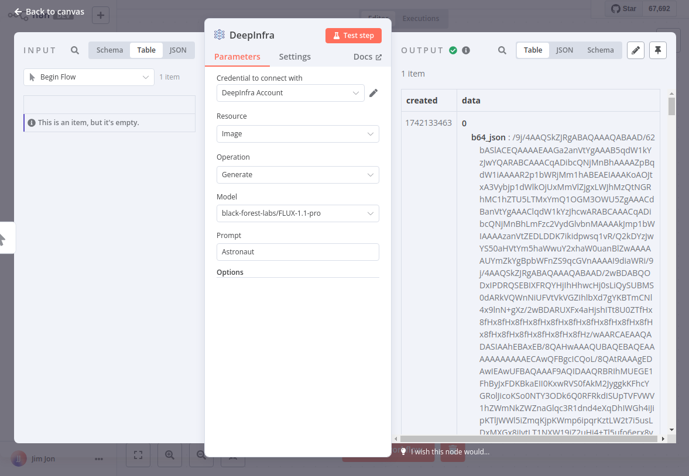
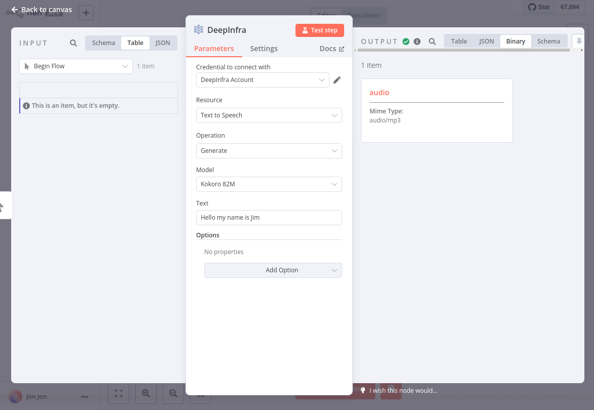

# n8n-nodes-deepinfra

This is an n8n community node. It lets you use DeepInfra API for various AI operations including chat completions, embeddings, and image generation.

## Features

- **Chat**: Generate text responses using various LLM models like Meta-Llama 3.3, DeepSeek, Mistral, and more
- **Embedding**: Create vector embeddings from text using models like Cohere Embed and Jina Embeddings
- **Image**: Generate images from text prompts using models like Stable Diffusion XL, Midjourney, and more

[n8n](https://n8n.io/) is a [fair-code licensed](https://docs.n8n.io/reference/license/) workflow automation platform.

## Installation

Follow the [installation guide](https://docs.n8n.io/integrations/community-nodes/installation/) in the n8n community nodes documentation.

## Usage

1. Add your DeepInfra API key in the n8n credentials manager
2. Add the DeepInfra node to your workflow
3. Select the resource you want to use (Chat, Embedding, Image, ...)
4. Select the operation for the chosen resource (Completion, Embed, Generate, ...)
5. Configure the parameters for your selected operation
6. Connect the node to the rest of your workflow

### Chat Completion Example

Use the Chat resource to generate conversational responses from powerful language models.

### Embedding Example

Create vector embeddings from text for semantic search, clustering, and other NLP tasks.

### Image Generation Example

Generate stunning images from text prompts using state-of-the-art image generation models.

### Text-to-Speech Example

Convert text to natural-sounding speech with various voice options.

### Transcription Example

Transcribe audio to text with high accuracy for various languages and accents.

## Resources

- [DeepInfra API Documentation](https://deepinfra.com/docs/api/)

